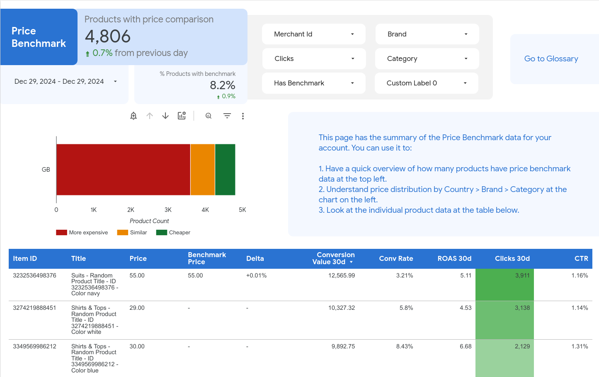
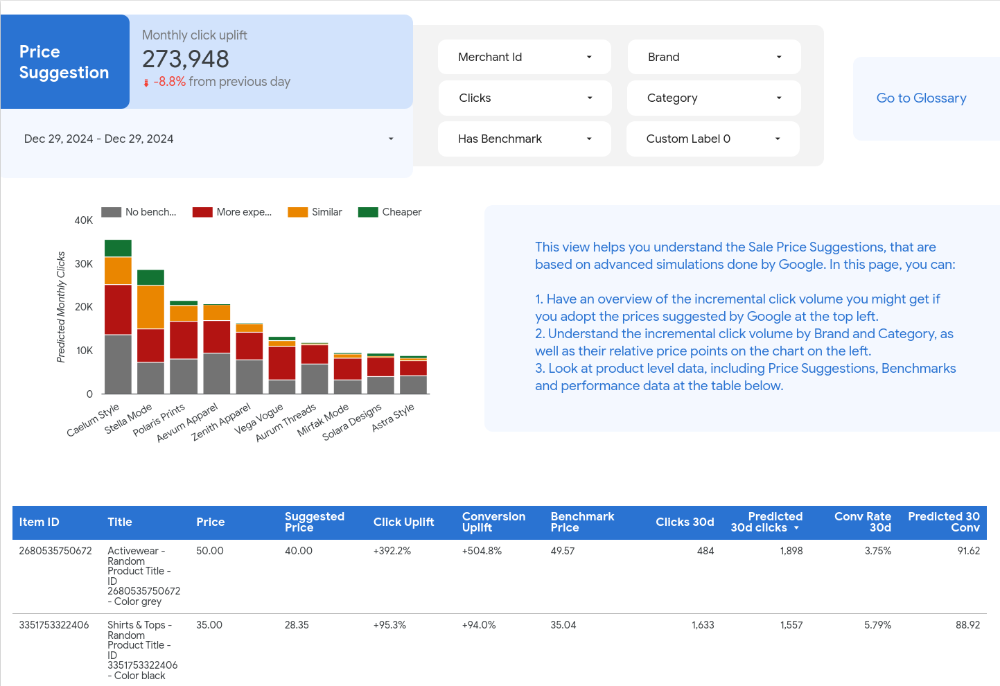
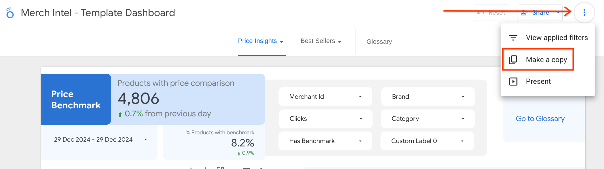
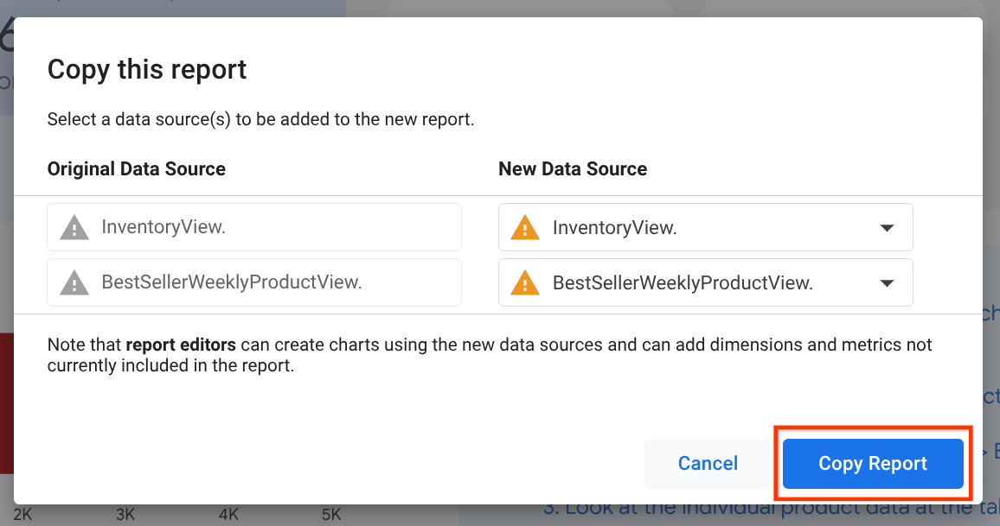
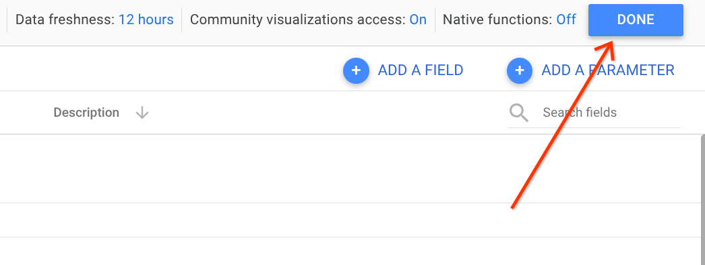

# Merch Intel

Disclaimer: This is not an officially supported Google product.

Merch Intel is a dashboard for visualizing Market Insights data from Google
Merchant Center. This includes best-selling products and brands, competitive
price points, sale price suggestions, and information about the competitive
landscape for your industry.


## 1. The Problem

Developing product pricing strategy based on Merchant Center Market Insights can
be a manual and time-consuming process. Merchants need to manually gather the
data and share it with their internal teams, a lengthy process that leads to
delays in pricing decisions, potential inaccuracies and difficulty in adapting
quickly to market changes.

## 2. The Solution

**Merch Intel** is a Looker Studio dashboard that connects Merchant Center and
Google Ads data to surface Pricing and Popular Products information, integrated
with advertisers’ own performance data, all in one single place. It's a single
dashboard that consolidates all Market Insights available in Merchant Center and
can be shared by the advertiser with internal teams (e.g. Merchandising,
Pricing, Marketing).

Use cases vary depending on the advertiser's goals. With Merch Intel, you can: -
- **Leverage price benchmark** to develop a more informed and competitive
  pricing strategy that's based on accurate data.
- **Identify opportunities** to expand product offerings to capitalize on
  current trends & popular products, making your product inventory more relevant
  to your customers.
- **Spot emerging opportunities** of products with high demand that are out of
  stock and have a high potential of driving more sales.




## 3. Installation

### 3.1. Prerequisites

#### 3.1.1. A Google Cloud project with billing enabled

You may skip this step if you already have a Google Cloud account with billing
enabled.

* [Create a Google Cloud account](https://cloud.google.com/docs/get-started)

* [Create and manage projects](https://cloud.google.com/resource-manager/docs/creating-managing-projects)

* [Manage your Cloud Billing account](https://cloud.google.com/billing/docs/how-to/manage-billing-account)

#### 3.1.2. Google Merchant Center, Google Ads and Google Cloud permissions

The user running the installation script will need the following permissions:

* [Standard access for Google Merchant Center](https://support.google.com/merchants/answer/1637190?hl=en)

* [Standard access for Google Ads](https://support.google.com/google-ads/answer/7476552?hl=en)

* [Editor (or owner) role in the Google Cloud project](https://cloud.google.com/iam/docs/understanding-roles)

NOTE: If you're running this using an MCA account as your Merchant Center ID, you won't have access to the Best Seller section in the dashboard (last two tabs) due to a [lack of support](https://cloud.google.com/bigquery/docs/merchant-center-transfer#multi-client_account_mca_support) for Multi-Client Accounts for the BestSeller reports on the Merchant Center exports.

### 3.2. Setup local environment

### 3.2.1. Option 1: Cloud Shell

Merch Intel can be installed directly in the Google Cloud console using
[Cloud Shell](https://ssh.cloud.google.com/cloudshell?shellonly=true), which
comes with `gcloud` already installed. It does however disconnect after 1 hour
without any user interaction and may require, for Google Merchant Center
accounts with a large number of products, the user to press Enter while the
script is running to reset the timer.

### 3.2.2. Option 2: Local

Merch Intel can also be installed on a local environment, which will not time
out but requires `gcloud` to be installed and set up manually:

* [Install Google Cloud CLI](https://cloud.google.com/sdk/?e=48754805&hl=en#Quick_Start)

### 3.3. Download source code

Open [Cloud Shell](https://ssh.cloud.google.com/cloudshell?shellonly=true) or
your terminal (if running locally) and download the repository from GitHub.

```
git clone https://github.com/google-marketing-solutions/merch-intel
```

### 3.4. Run install script

The following values will be needed to run the installation script:

* [Google Cloud project ID](https://cloud.google.com/resource-manager/docs/creating-managing-projects)

* [Google Merchant Center ID](https://support.google.com/merchants/answer/12159157?hl=en)

* [Google Ads customer ID](https://support.google.com/google-ads/answer/1704344?hl=en)

```
cd merch-intel;
sh setup.sh --project_id=<project_id> --merchant_id=<merchant_id> --ads_customer_id=<ads_customer_id>
```

During installation, the script may ask you to open authorization URLs in the
browser. Follow the instructions to proceed.

The script will perform the following:

* Enable Google Cloud components and Google APIs:

 * [BigQuery](https://console.cloud.google.com/bigquery)

 * [BigQuery Data Transfer](https://console.cloud.google.com/bigquery/transfers)

* Create the Google Merchant Center and Google Ads BigQuery data transfers.

* Set up a daily job that will create the `InventoryView` and
`BestSellerWeeklyProductView` Merch Intel tables

### 3.5. Creating dashboard

Once you're done with the deployment of the code in GCP and you have all the
tables created, it's time to make a copy of the dashboard template and point it
to your recently created data.

-   Start by joining
    [this Google Group](https://groups.google.com/g/merch-intel-dashboard-template-readers/)
    in order to have access to the template dashboard. Make sure to be logged in
    your Google account before accessing the link.
-   Open the template dashboard
    [using this link](https://lookerstudio.google.com/c/reporting/cd1b8fa2-e7d5-4ac4-874f-e022ebd20467/).
-   At the dashboard template, click the 3-dot menu on the top right, then click
    "Make a copy". 
-   You'll see a popup asking you to pick the data sources for the new
    dashboard. There's no need to choose a different data source for now, even
    though you see the warning signs there. Just click "Copy report".
    
-   A new tab is going to open, with your dashboard. On the top menu, click
    `Resource > Manage added data sources`.
-   On this screen, you'll replace the template data sources your newly created
    ones, in BigQuery. You'll perform these next steps twice, once for
    `InventoryView` and once for the `BestSellerWeeklyProductView`. Click `EDIT`
    under actions on the first data source.
-   On the next screen, click `My Projects` on the left-hand side of the screen
    and navigate to the Project Id you used to deploy Merch Intel. The Dataset
    Id should be `merch_intel`, the default name when you deploy it and the
    names of the tables will be the same as the name of the data sources in
    Looker Studio: `InventoryView` and `BestSellerWeeklyProductView`.
-   Click the Connect button at the top right of that screen and feel free to
    click Apply for any possible semantic changes in the popup that shows (you
    may not see that popup and that's fine).
-   Make sure to click `Done` after you're finished linking both your new data
    sources. 
-   You can now close the "Data sources" menu and you should have your dashboard
    ready to be shared and used.

Note - Performance metrics in the dashboard may take 12-24 hours to appear.

## 4. Use Cases

We've discussed the insights you can take out of each view of the dashboard and
added suggested actions that could be taken based on those insights. You can
access that information in the links below:

- [Price Benchmark](./docs/use_cases/price_benchmark.md)
- [Benchmark Breakdown](./docs/use_cases/benchmark_breakdown.md)
- [Price Suggestion](./docs/use_cases/price_suggestion.md)
- [Best Sellers Overview](./docs/use_cases/best_sellers_overview.md)
- [Best Sellers Details](./docs/use_cases/best_sellers_details.md)

There is also a Glossary tab at the dashboard (the last one) that goes over the
definitions of each metric and dimension on the dashboard. You can also find
the Glossary [here](./docs/glossary/glossary.md).
