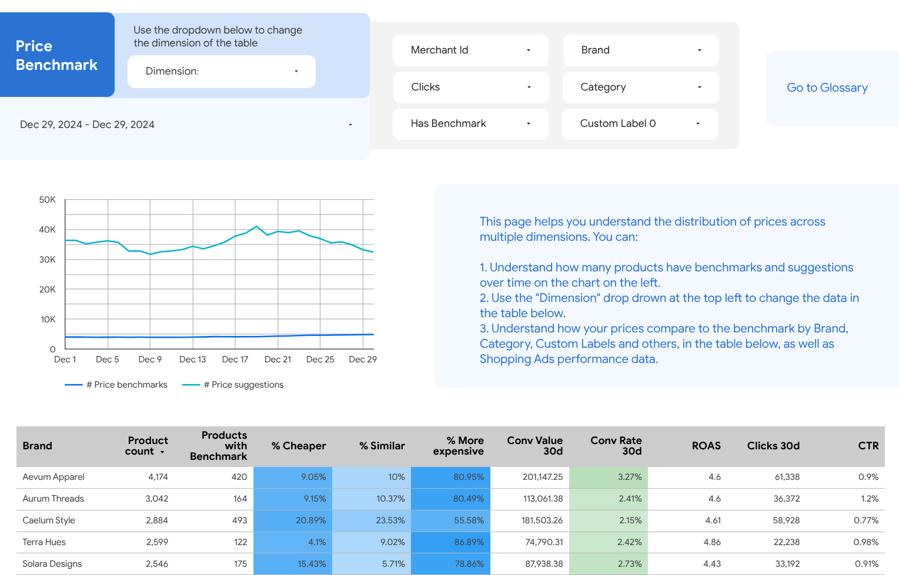

# Benchmark Breakdown View

## Details

This section provides **insights into your brand, custom label or product
category pricing compared to market benchmarks**, allowing you to identify
opportunities for improvement.

## Suggested actions

1.  Focus on brands where a significant portion of the catalog is priced above
    market benchmarks. This signals a potential issue with the overall pricing
    strategy. Your merchandising team can analyze these brands and consider
    adjusting prices to improve competitiveness and increase sales volume.
